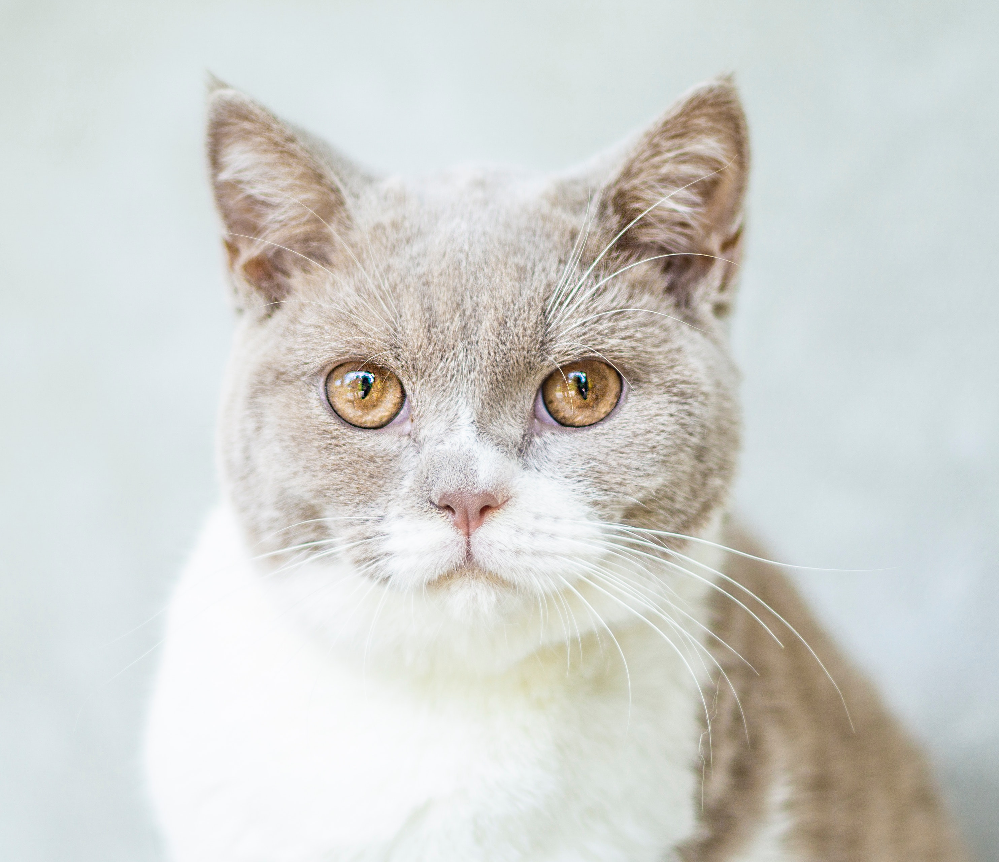

This demo(based on @greyovo's [jupyter notebook](https://colab.research.google.com/drive/1bW1aMg0er1T4aOcU5pCNYVgmVzBJ4-x4#scrollTo=hPscj2wlZlHb)) show the inference result for the same text & image input with different model, including the [original CLIP](https://github.com/openai/CLIP) and the onnx quantized model. Test result on my local machine is as follows:
| model   | result  |
|---|---|
| [CLIP](https://github.com/openai/CLIP) | [[6.1091479e-02 9.3267566e-01 5.3717378e-03 8.6108845e-04]] |
| clip-image-encoder.onnx & clip-text-encoder.onnx | [[6.1091259e-02 9.3267584e-01 5.3716768e-03 8.6109847e-04]] |
| clip-image-encoder-quant-int8.onnx & clip-text-encoder-quant-int8.onnx | [[4.703762e-02 9.391219e-01 9.90335e-03 3.93698e-03]] |

The test input text is ["a tiger", "a cat", "a dog", "a bear"] and the test image is as follows:
